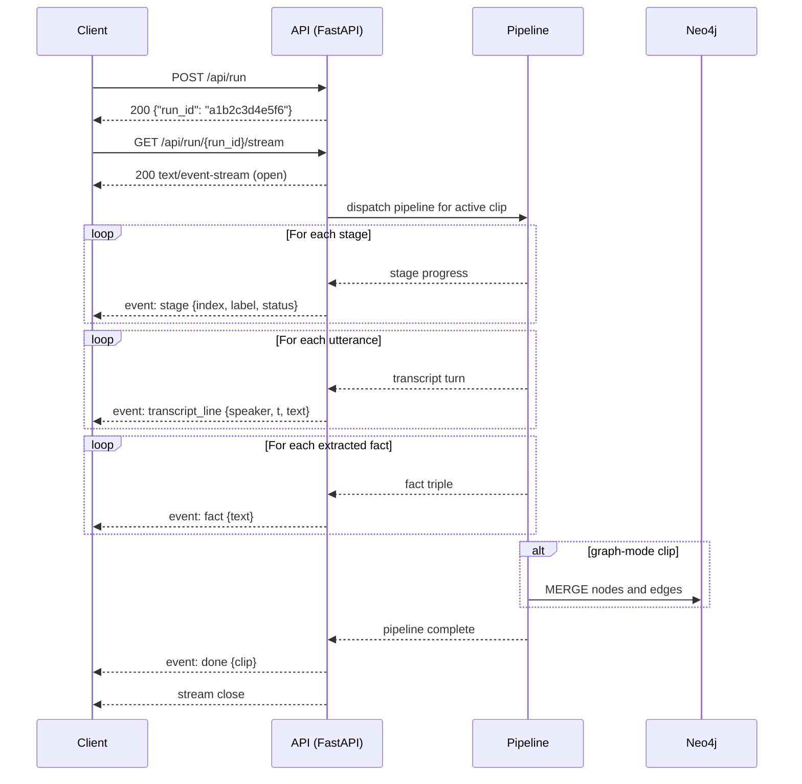

# Atyx Convo-KG — API Specification

See also: [Entity Relationship](entity-relationship.md) · [System Architecture](system-architecture.md) · [Sequence Diagrams](sequence-diagrams.md) · [Product Overview](product-overview.md)

---

## Overview

| Property | Value |
|----------|-------|
| Framework | FastAPI + uvicorn |
| Base URL | `http://localhost:8000` |
| Data format | JSON (all endpoints except SSE stream and upload) |
| Route prefix | `/api/*` — all API routes; static frontend served at `/` |
| Authentication | **None.** This is a local, single-user research prototype. There are no user accounts, login flows, tokens, or API keys. Access control is process-level: the server runs on localhost and is not exposed to the network. |
| Concurrency | The live pipeline runs serially; a second `POST /api/run` while a live pipeline is executing returns an SSE `error` event (no queue, no parallel runs). |
| Error model | Standard FastAPI `{"detail": "<message>"}` JSON body; see [Error Handling](#error-handling). |

The frontend (`frontend/index.html`) is a single-file dc-app (a custom lightweight React-like runtime) served as a static mount at `/`. The `/api/*` routes are registered first and take priority.

---

## Endpoints

### 1. `GET /api/graph`

**Purpose:** Return the concept graph for the currently active `graph`-mode clip. This is the data that populates the knowledge-graph SVG panel and the Ask-Atyx chat context in the UI.

Only `:Entity`, `:Claim`, and `:Attribute` nodes and the fact edges between them are returned. The provenance backbone (`:Speaker`, `:Statement`) is not included in this response; it surfaces only through the `provenance` field of Q&A answers.

**Parameters:** none

**Response:**

```json
{
  "nodes": [
    {"id": "pms_fund_001", "label": "Entity", "type": "Fund", "name": "PMS"},
    {"id": "pms_strategy_002", "label": "Claim", "name": "Outperform benchmark index"}
  ],
  "edges": [
    {"from": "pms_fund_001", "to": "pms_strategy_002", "relation": "AIMS_TO"}
  ]
}
```

**Status codes:**

| Code | Condition |
|------|-----------|
| 200 | Graph returned (may be empty `{nodes:[], edges:[]}` if not yet populated) |

---

### 2. `POST /api/ask`

**Purpose:** Submit a natural-language question; receive an English answer grounded in the knowledge graph. Operates on the active `graph`-mode clip.

The Q&A layer first attempts text-to-Cypher (single-hop). On failure it falls back to semantic search over statement embeddings. If the best statement cosine similarity is below 0.40, the answer is declined (no-hallucination floor) and `found` is set to `false` — this is still HTTP 200, never a 404.

**Request body:**

```json
{"question": "What strategy does the PMS follow?"}
```

| Field | Type | Required | Description |
|-------|------|----------|-------------|
| `question` | `string` | yes | Natural-language question in English |

**Response (QAResult):**

```json
{
  "question": "What strategy does the PMS follow?",
  "answer": "The PMS follows an actively managed equity strategy targeting alpha above the benchmark index.",
  "mode": "cypher",
  "found": true,
  "cypher": "MATCH (p:Entity {name: 'PMS'})-[r]->(s) RETURN s.name, type(r)",
  "rows": [{"s.name": "actively managed equity strategy", "type(r)": "FOLLOWS"}],
  "provenance": [
    {
      "statement_id": "stmt_042",
      "speaker": "SPEAKER_00",
      "text": "PMS basically follows an active equity strategy to beat the benchmark.",
      "kind": "source"
    }
  ],
  "graph_node_ids": ["pms_fund_001", "pms_strategy_002"],
  "hops": "single"
}
```

| Field | Type | Notes |
|-------|------|-------|
| `mode` | `"cypher" \| "semantic-fallback"` | Which resolution path succeeded |
| `found` | `bool` | `false` = declined; HTTP is still 200 |
| `cypher` | `string \| null` | The Cypher query that was executed (cypher mode only) |
| `rows` | `array` | Raw rows from Cypher (cypher mode) or empty (semantic mode) |
| `provenance` | `Provenance[]` | Verbatim quotes from `:Statement` nodes; `kind="source"` is causal, `kind="related"` is context |
| `graph_node_ids` | `string[]` | Node ids highlighted in the graph SVG |
| `hops` | `"single" \| "multi"` | Query hop depth; currently always `"single"` |

**Status codes:**

| Code | Condition |
|------|-----------|
| 200 | Always (including `found: false` — no answer is still 200) |

---

### 3. `GET /api/experiment`

**Purpose:** Return the controlled-SNR fidelity curve and spot-check rows from the pre-computed evaluation run. Used by the **Experiment** tab.

**Parameters:** none

**Response (EvalResult):**

```json
{
  "curve": [
    {"snr": 20, "similarity": 0.94},
    {"snr": 15, "similarity": 0.91},
    {"snr": 10, "similarity": 0.84},
    {"snr": 5,  "similarity": 0.71},
    {"snr": 0,  "similarity": 0.52}
  ],
  "spotcheck": [
    {
      "question": "What strategy does the PMS follow?",
      "clean_answer": "The PMS follows an actively managed equity strategy targeting alpha above the benchmark.",
      "degraded_answer": "The PMS... active equity strategy... targeting performance above index.",
      "degraded_snr": 5
    }
  ],
  "meta": {
    "source_clip": "pms",
    "noise_file": "noises/cafe_16k.wav",
    "slice_s": 160,
    "snr_levels": [20, 15, 10, 5, 0]
  }
}
```

**Status codes:**

| Code | Condition |
|------|-----------|
| 200 | Evaluation artifact found and returned |
| 404 | `data/ground_truth/snr_results.json` is absent (evaluation not yet run) |

---

### 4. `GET /api/clips`

**Purpose:** List all clips in the clip registry, including the currently active clip id. Used to populate the clip dropdown in the UI.

**Parameters:** none

**Response:**

```json
{
  "active": "pms",
  "clips": [
    {
      "id": "pms",
      "label": "PMS Advisory (Hinglish)",
      "mode": "graph",
      "domain": "private-wealth",
      "speakers": 2
    },
    {
      "id": "call_100",
      "label": "911 — Water Rescue",
      "mode": "facts",
      "domain": "emergency-dispatch",
      "speakers": 1
    },
    {
      "id": "call_103",
      "label": "911 — Active Shooter",
      "mode": "facts",
      "domain": "emergency-dispatch",
      "speakers": 1
    }
  ]
}
```

Uploaded clips (mode `live`) are transient and do not appear in this registry.

**Status codes:**

| Code | Condition |
|------|-----------|
| 200 | Always |

---

### 5. `POST /api/select_clip`

**Purpose:** Switch the server's active clip. Switching to a `graph`-mode clip triggers a best-effort Neo4j snapshot restore if the database is empty (node count = 0). Switching to a `facts` or `live` clip never touches Neo4j — this is the **HERO INVARIANT** that keeps the verified PMS graph intact during demos.

**Request body:**

```json
{"id": "call_100"}
```

| Field | Type | Required | Description |
|-------|------|----------|-------------|
| `id` | `string` | yes | Clip id to activate; must match `^[A-Za-z0-9_-]{1,64}$` |

**Response:**

```json
{"active": "call_100", "mode": "facts"}
```

**Status codes:**

| Code | Condition |
|------|-----------|
| 200 | Clip switched |
| 400 | `id` fails the allowlist regex |
| 404 | `id` passes regex but does not exist in the clip registry |

---

### 6. `POST /api/run`

**Purpose:** Initiate a pipeline run for the currently active clip. Returns a `run_id` immediately; progress and results are streamed via SSE (endpoint 7). The server holds the mapping from `run_id` to clip in memory.

**Request body:** empty / no body required

**Response:**

```json
{"run_id": "a1b2c3d4e5f6"}
```

The `run_id` is a 12-character lowercase hex string.

**Status codes:**

| Code | Condition |
|------|-----------|
| 200 | Run accepted; stream at `GET /api/run/{run_id}/stream` |

---

### 7. `GET /api/run/{run_id}/stream`

**Purpose:** Open a Server-Sent Events (SSE) stream for a running or replayable pipeline run. The stream emits typed events as the pipeline progresses, then closes.

**Path parameters:**

| Parameter | Type | Description |
|-----------|------|-------------|
| `run_id` | `string` | The `run_id` returned by `POST /api/run` |

**Query parameters:**

| Parameter | Type | Default | Description |
|-----------|------|---------|-------------|
| `replay` | `0 \| 1` | `0` | `1` = read from the committed `.facts.json` artifact (fast replay, no LLM call); `0` = re-run extraction live (LLM is called, results are display-only and never upserted to Neo4j) |

**Response:** `Content-Type: text/event-stream`

Each SSE message has the format:
```
event: <type>
data: <JSON payload>

```

#### Event types

**`stage`** — Pipeline stage status update.

```
event: stage
data: {"index": 0, "label": "Denoise", "sub": "Removing background noise", "status": "running", "replayed": false}
```

| Field | Type | Values |
|-------|------|--------|
| `index` | `int` | Stage index (0-based) |
| `label` | `string` | Human-readable stage name |
| `sub` | `string` | Sub-label / description |
| `status` | `string` | `"running"` · `"done"` · `"skipped"` |
| `replayed` | `bool` | `true` if this event comes from cached data |

Graph-mode clips have 5 stages (Denoise, Diarize, Transcribe, Extract, Graph Build). Facts/live-mode clips have 4 stages (no Graph Build).

---

**`transcript_line`** — One speaker turn from the transcribed audio.

```
event: transcript_line
data: {"speaker": "SPEAKER_00", "t": 3.2, "text": "PMS ke baare mein baat karte hain — so basically the idea is to outperform the benchmark."}
```

| Field | Type | Description |
|-------|------|-------------|
| `speaker` | `string` | Diarized speaker id |
| `t` | `float` | Start time in seconds |
| `text` | `string` | Hinglish→English transcribed text |

---

**`fact`** — One extracted fact from the LLM extraction stage.

```
event: fact
data: {"text": "PMS [FOLLOWS] actively managed equity strategy"}
```

| Field | Type | Description |
|-------|------|-------------|
| `text` | `string` | Human-readable summary of the fact triple |

---

**`done`** — Pipeline completed successfully.

```
event: done
data: {"clip": "pms"}
```

| Field | Type | Description |
|-------|------|-------------|
| `clip` | `string` | The clip id that was processed |

---

**`error`** — Pipeline failed. The stream closes after this event; no `done` is emitted.

```
event: error
data: {"message": "Pipeline failed: mlx-whisper model not found"}
```

| Field | Type | Description |
|-------|------|-------------|
| `message` | `string` | Human-readable error description |

**Status codes:**

| Code | Condition |
|------|-----------|
| 200 | Stream opened (errors surface as SSE `error` events, not HTTP error codes) |
| 404 | `run_id` not found in the in-memory run registry |

**Concurrency guard:** a `_LIVE_RUNNING` boolean prevents concurrent live pipeline runs. If a live pipeline is already in progress when the stream is opened, an `error` event is emitted immediately and the stream closes.

---

### 8. `POST /api/upload`

**Purpose:** Upload an audio file to create a new transient clip in `live` mode. The server validates the file, re-encodes to 16 kHz mono, and writes it to `data/raw/<clip_id>.wav`. The clip is not added to the registry and does not touch Neo4j.

**Request:** `multipart/form-data`

| Field | Type | Required | Description |
|-------|------|----------|-------------|
| `file` | binary | yes | Audio file (any format accepted by librosa/soundfile) |

**Hard cap:** audio duration must not exceed **600 seconds (10 minutes)**.

**Response:**

```json
{"clip_id": "upload_a3f72bc90e"}
```

The `clip_id` always matches `^upload_[0-9a-f]{10}$` — a fixed prefix plus 10 random hex characters. This pattern is enforced at the `_clip_mode` chokepoint to prevent path-traversal attacks.

**Status codes:**

| Code | Condition |
|------|-----------|
| 200 | Upload accepted; use `POST /api/select_clip` then `POST /api/run` to process |
| 400 | File is not recognized audio, or duration exceeds 600 s |

---

## SSE Streaming Flow



---

## Error Handling

All non-SSE error responses use the standard FastAPI envelope:

```json
{"detail": "<human-readable message>"}
```

### HTTP status code table

| Code | Trigger | Example `detail` |
|------|---------|-----------------|
| 400 | `select_clip` — id fails `^[A-Za-z0-9_-]{1,64}$` | `"Invalid clip id"` |
| 400 | `upload` — file is not audio | `"File is not a recognized audio format"` |
| 400 | `upload` — audio duration > 600 s | `"Audio exceeds 10-minute limit (614 s)"` |
| 404 | `select_clip` — id not in registry | `"Unknown clip: xyz"` |
| 404 | `experiment` — SNR results file absent | `"Experiment results not found; run eval first"` |
| 404 | `stream` — `run_id` not in memory registry | `"Unknown run id"` |

### SSE error events

Pipeline failures (ASR crash, LLM timeout, Neo4j unreachable) do not produce an HTTP error code — the HTTP 200 and stream are already open. Instead, an `error` event is emitted and the stream closes cleanly. The client must handle both the HTTP error path (for connection-phase failures) and the SSE `error` event (for in-flight failures).

---

## Security Notes

This is a local, single-user prototype with no network exposure. The following input-validation measures are in place as correctness and safety guards, not as a security perimeter:

| Concern | Mechanism |
|---------|-----------|
| Path traversal via clip id | `_clip_mode()` chokepoint enforces `^[A-Za-z0-9_-]{1,64}$`; uploaded ids additionally constrained to `^upload_[0-9a-f]{10}$` |
| LLM prompt injection into Cypher | All Cypher is parameterized; no LLM-generated string is interpolated into a query. Node labels come from a closed allowlist; relation types are validated by `safe_rel_type` (charset + length check) before being used as relationship type identifiers |
| Write operations from Q&A | Generated Cypher passes a write-clause text guard (rejects `MERGE`, `CREATE`, `SET`, `DELETE`, etc.), then an `EXPLAIN` parse validation, then executes in a Neo4j **read-access transaction** — three independent layers |
| No-hallucination floor | Semantic fallback declines to answer when the best statement-embedding cosine similarity is below 0.40; `found: false` is returned instead of a confabulated answer |
| Concurrent pipeline abuse | `_LIVE_RUNNING` boolean prevents overlapping live runs; a second attempt receives an SSE `error` event immediately |
