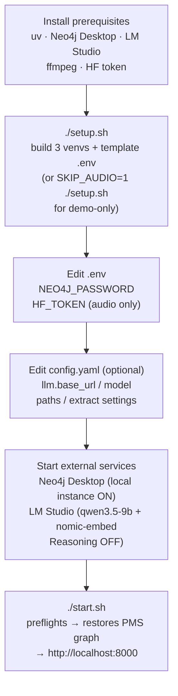

# Atyx Convo-KG — Deployment Guide

> **Scope:** local, single-user prototype on Apple M4 / 24 GB. There is no cloud
> deployment, no containers shipped, and no authentication. See
> [Production considerations](#production-considerations) for what productionising would
> require.

---

## Setup → configure → start sequence



---

## Prerequisites

These must be installed **before** running `setup.sh`. The project does not install them.

| Prerequisite | Purpose | Notes |
|-------------|---------|-------|
| **uv** | Python env manager used by `setup.sh` | `curl -LsSf https://astral.sh/uv/install.sh \| sh` |
| **Neo4j Desktop** | Local graph database (Community edition) | Start a local instance; note the bolt port (default `7687`) and set a password |
| **LM Studio** | Local LLM runtime — OpenAI-compatible endpoint | Load `qwen/qwen3.5-9b` (4-bit) and `text-embedding-nomic-embed-text-v2-moe`; **disable Reasoning/Thinking** in model settings |
| **HF token** | HuggingFace token for pyannote.audio model download | Required only for the audio pipeline (diarization); set in `.env` as `HF_TOKEN`. Not needed for demo-only (`SKIP_AUDIO=1`) setup |
| **ffmpeg** | Audio re-encoding for upload and preprocessing | `brew install ffmpeg` on macOS |

**Target machine:** Apple M4, 24 GB unified memory. The pipeline runs stages sequentially so
only one heavy model is in memory at a time. A machine with less RAM may work for the
demo-only path (no audio pipeline) but has not been tested.

---

## Installation

### Recommended: shell script

```bash
# Clone and enter the repo
git clone <repo-url> atyx-convo-kg
cd atyx-convo-kg

# Build all three venvs + template .env (takes several minutes; downloads torch models)
./setup.sh

# Demo-only (skips .venv-asr and .venv-denoise — sufficient for Ask/Graph/Experiment)
SKIP_AUDIO=1 ./setup.sh
```

`setup.sh` creates:
- `.venv` — main env, Python 3.12, torch-free: FastAPI, Neo4j driver, LLM client, Q&A, extraction
- `.venv-asr` — Python 3.12: mlx-whisper large-v3 + pyannote.audio (torch 2.2.2 / torchaudio 2.2.2)
- `.venv-denoise` — Python 3.11: DeepFilterNet (torch 2.0.1)

It also writes a template `.env` file if one does not exist (with placeholder values that
must be filled in before running).

### Manual venv commands (equivalent to setup.sh)

```bash
# Main venv
uv venv .venv --python 3.12
uv pip install -e . --python .venv/bin/python

# ASR venv
uv venv .venv-asr --python 3.12
uv pip install -r requirements-asr.txt --python .venv-asr/bin/python

# Denoise venv
uv venv .venv-denoise --python 3.11
uv pip install -r requirements-denoise.txt --python .venv-denoise/bin/python
```

---

## Configuration

### `.env` — secrets and service credentials

Created by `setup.sh` with placeholders. Edit before first run:

```dotenv
NEO4J_URI=bolt://localhost:7687
NEO4J_USERNAME=neo4j
NEO4J_PASSWORD=<your-neo4j-password>
NEO4J_DATABASE=neo4j
HF_TOKEN=<your-huggingface-token>   # needed only for audio pipeline / pyannote
```

| Key | Description |
|-----|-------------|
| `NEO4J_URI` | Bolt URI for your local Neo4j instance (default `bolt://localhost:7687`) |
| `NEO4J_USERNAME` | Neo4j username (default `neo4j`) |
| `NEO4J_PASSWORD` | Password set in Neo4j Desktop |
| `NEO4J_DATABASE` | Database name (default `neo4j`; Community edition has one database) |
| `HF_TOKEN` | HuggingFace access token — pyannote gated models; leave blank if `SKIP_AUDIO=1` |

### `config.yaml` — model, paths, extraction, demo clips

```yaml
llm:
  base_url: http://localhost:1234/v1   # LM Studio default
  model: qwen/qwen3.5-9b
  embed_model: text-embedding-nomic-embed-text-v2-moe

paths:
  raw: data/raw
  work: data/work
  noisy: data/noisy
  ground_truth: data/ground_truth
  uploads: data/uploads

extract:
  chunk_tokens: 700       # soft token target per extraction chunk
  overlap_tokens: 200     # context overlap between chunks
  confidence_threshold: 0.6

demo:
  clip: pms               # default active clip at startup
  clips:
    - {id: pms,      label: PMS-advisory.wav,  mode: graph, domain: "Private-wealth advisory (Hinglish)", speakers: 2}
    - {id: call_100, label: call_100.wav,       mode: facts, domain: "911 dispatch — water rescue",       speakers: 2}
    - {id: call_103, label: call_103.wav,       mode: facts, domain: "911 dispatch — active shooter",     speakers: 2}
```

Key settings to adjust:

| Setting | When to change |
|---------|---------------|
| `llm.base_url` | If LM Studio is on a non-default port or a different host |
| `llm.model` | To swap to a different locally loaded model |
| `extract.chunk_tokens` | Smaller values reduce repetition loops on dense conversations; current 700 was tuned for qwen3.5-9b |
| `demo.clip` | Default clip loaded at UI startup |

---

## Running

### Standard start

```bash
./start.sh
```

`start.sh` performs three preflight checks before launching:

| Preflight | What it checks | If it fails |
|-----------|---------------|-------------|
| Neo4j reachable | Imports `src.graph` and tests a bolt connection | Fatal — exits with instructions |
| LM Studio reachable | `curl` to `http://localhost:1234/v1/models` | **Non-fatal** — prints a warning; Graph and Experiment tabs still work; Ask Atyx and live Run require the LLM |
| Port available | Checks that the target port (default 8000) is free | Fatal — prints offending PIDs |

After preflights pass:
1. If the Neo4j database is empty, `start.sh` restores the verified PMS graph snapshot
   from `data/ground_truth/*_graph_snapshot.json` automatically.
2. uvicorn starts at `127.0.0.1:8000`.
3. The browser is opened at `http://localhost:8000` after a 2-second delay.

### Useful variants

```bash
# Force-reset Neo4j to the committed PMS snapshot (clears any in-session writes)
./start.sh --restore

# Use a different port (e.g. if 8000 is taken)
PORT=8001 ./start.sh
```

If `start.sh` reports port conflicts:

```
Port 8000 in use by PIDs: 12345
Try: PORT=8001 ./start.sh
```

---

## Verification

After `./start.sh` succeeds and the browser opens, verify the system is working:

**1. Graph is loaded (Neo4j)**

Open the Console tab. The Knowledge Graph panel should render nodes immediately (the PMS
snapshot is pre-loaded). If it is blank, check that Neo4j Desktop shows the local instance
as running and that `NEO4J_PASSWORD` in `.env` matches.

**2. LM Studio is reachable**

The three green preflight lines in the terminal should include a LM Studio line. If it shows
a yellow warning instead, open LM Studio, confirm the server is started (Local Server tab),
and that `qwen3.5-9b` is loaded with **Reasoning/Thinking OFF**.

**3. Golden Q&A spot-check**

In the Ask Atyx chat, ask:

- **"What strategy does a PMS follow?"** → should return `mode: cypher` with a source quote
- **"How does a PMS differ from a mutual fund?"** → should return `mode: semantic-fallback` with a related quote
- **"What is the capital of France?"** → should return `found: false` ("I couldn't find that in the conversation")

The third check verifies the no-hallucination floor is active.

**4. Experiment tab**

Click the Experiment tab. The SNR fidelity curve should render (five SNR levels: 20/15/10/5/0
dB). If it shows "no data", `data/ground_truth/snr_results.json` is absent — this is
pre-computed and should be in the repo; check that `git lfs pull` or equivalent has run if
large files are tracked separately.

---

## Production considerations

> This section documents what production deployment **would** require. None of it is built.
> The reviewer is expected to see these as honest forward-looking scope items, not missing
> features of the prototype.

| Concern | Current state | Production path |
|---------|--------------|----------------|
| **Authentication** | None — single local user, no login | Add an auth layer (e.g. OAuth2 / JWT) before the FastAPI routes; `api.py` has no auth hooks today |
| **Multi-tenancy** | None — single analyst using the app | Session isolation, user-scoped data, rate limiting |
| **Per-clip graph namespacing** | Neo4j Community = one database; uploaded/facts clips share no graph namespace | Neo4j Enterprise (multiple databases) or add a `clip_id` property scope and rewrite all Cypher to filter by it; or deploy one Neo4j instance per session |
| **Containerization** | No Docker/Compose shipped | Containerise each venv as a separate image or use a multi-stage Dockerfile; the three-venv subprocess model maps cleanly onto microservices |
| **GPU / hosted models** | All inference on CPU/MPS (M4 unified memory) | Move ASR and LLM to a GPU host (NVIDIA A10/A100) via the existing OpenAI-compatible endpoint abstraction (`config.yaml` base_url); no code change required for the LLM client |
| **Ingestion queueing** | Serial, one clip at a time; `_LIVE_RUNNING` boolean blocks concurrent runs | Replace the boolean guard with a proper job queue (Celery, RQ, or a simple asyncio queue with worker pool) |
| **Streaming ingestion** | Batch only; a 10-min clip takes minutes end-to-end | Chunk-level streaming would require breaking the sequential stage model; feasible with a streaming ASR backend |
| **Graph scaling** | Single Neo4j instance, no indexing tuned beyond defaults | Add index on `:Entity(name)` and `:Statement(clip)` for query performance at scale; consider graph partitioning by domain |
| **Model quality ceiling** | Local ~9B on noisy Hinglish; extraction is non-deterministic run-to-run | Stronger model (13B+ or a frontier API for extraction only) or a two-pass verification step; see `design_note.md` § Measured capability boundary |

---

**See also:** [./system-architecture.md](./system-architecture.md) · [./api-specification.md](./api-specification.md) · [./sequence-diagrams.md](./sequence-diagrams.md) · [./product-overview.md](./product-overview.md) · [./index.md](./index.md)
