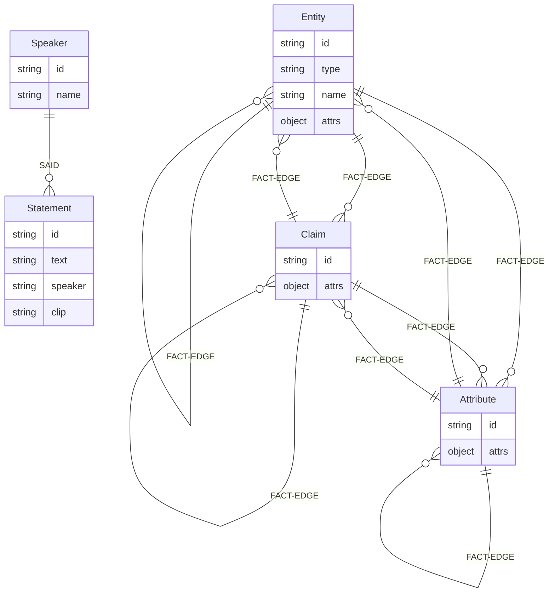
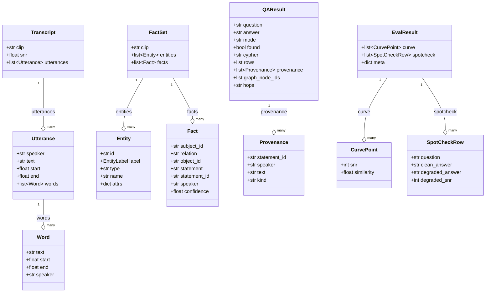

# Atyx Convo-KG — Entity Relationship (Graph Schema)

> **Note:** This is a **Neo4j property graph**, not a relational database. The ER diagram below models Neo4j node labels as entities and Neo4j relationships as edges. Cardinality lines express the direction and multiplicity of directed edges in the graph, not foreign-key constraints. Attributes listed on relationship types are stored as Neo4j relationship properties.

See also: [API Specification](api-specification.md) · [System Architecture](system-architecture.md) · [Product Overview](product-overview.md)

---

## Graph Schema Diagram



**`FACT-EDGE` is a placeholder label.** The actual Neo4j relationship type on each fact edge is drawn from an **open, induced vocabulary** — examples: `AIMS_TO`, `FOLLOWS`, `HAS_COST`, `COMMITTED_TO`, `RELATES_TO`. Every relationship type is charset-validated via `safe_rel_type` (no raw LLM text is ever interpolated into a Cypher query). All fact edges carry a `source_statement_id` property that joins back to the `:Statement` provenance backbone.

---

## Schema Reference

### Node Labels

| Label | Attribute | Type | Meaning |
|-------|-----------|------|---------|
| `Speaker` | `id` | `string` | Unique diarized speaker identifier (e.g. `SPEAKER_00`) |
| | `name` | `string` | Human-readable speaker label (may equal id until resolved) |
| `Statement` | `id` | `string` | Unique utterance identifier |
| | `text` | `string` | English transcript of the utterance |
| | `speaker` | `string` | Speaker id of the diarized speaker who produced this utterance |
| | `clip` | `string` | Source clip id (e.g. `pms`) — ties the statement to its audio file |
| `Entity` | `id` | `string` | Unique concept node identifier (namespaced during extraction, resolved on upsert) |
| | `type` | `string` | Open-vocabulary type within the induced ontology (e.g. `Fund`, `Strategy`, `Person`) |
| | `name` | `string` | Canonical name after entity resolution |
| | `attrs` | `object` | Additional arbitrary attributes extracted by the LLM (open schema) |
| `Claim` | `id` | `string` | Unique claim/decision node identifier |
| | `attrs` | `object` | Open-schema attributes (e.g. `text`, `confidence`, `date`) |
| `Attribute` | `id` | `string` | Unique attribute/value node identifier |
| | `attrs` | `object` | Open-schema attributes (e.g. `value`, `unit`, `currency`) |

> **Allowlist enforcement.** Node labels are gated by a closed allowlist (`Speaker`, `Statement`, `Entity`, `Claim`, `Attribute`). The extraction LLM is explicitly forbidden from producing `Speaker` or `Statement` labels — those are reserved for the diarization-derived provenance backbone and may only be written by the pipeline orchestrator.

### Relationships

| Edge | From → To | Properties | Meaning |
|------|-----------|-----------|---------|
| `SAID` | `Speaker` → `Statement` | — | Attribution: this speaker produced this utterance |
| `<RELATION>` (fact edge) | `Entity\|Claim\|Attribute` → `Entity\|Claim\|Attribute` | `source_statement_id: string` | A grounded fact between two concept nodes; the relation type is a validated open-vocabulary string drawn from the induced ontology for the clip |

**Fact edge properties:**

| Property | Type | Meaning |
|----------|------|---------|
| `source_statement_id` | `string` | Foreign key into `:Statement`; enables the Q&A layer to retrieve the verbatim quote that grounded this fact |

---

## Provenance and Grounding

Every fact edge in the concept graph carries a `source_statement_id` property. This is the mechanism by which an extracted fact can be traced back to the exact spoken utterance that produced it:

```
(:Entity)-[:AIMS_TO {source_statement_id: "stmt_042"}]->(:Claim)
        ↑ join
(:Speaker {id: "SPEAKER_00"})-[:SAID]->(:Statement {id: "stmt_042", text: "..."})
```

The Q&A layer exploits this: after resolving a Cypher query, it fetches the `:Statement` nodes whose ids appear in `source_statement_id` properties on the matching edges and returns them as `Provenance` objects (kind `source` or `related`) alongside the answer. The frontend highlights the corresponding graph nodes and displays the verbatim quote as a `◆ source` attribution beneath the answer.

**Two-layer architecture summary:**

| Layer | Labels | Exposed in UI? | Purpose |
|-------|--------|---------------|---------|
| Provenance backbone | `:Speaker`, `:Statement` | No | Grounding — who said what, verbatim |
| Concept graph | `:Entity`, `:Claim`, `:Attribute` | Yes | Knowledge — facts, decisions, relationships |

`read_graph()` (the `/api/graph` endpoint) returns **only** the concept layer (`:Entity/:Claim/:Attribute` nodes and the fact edges between them). The provenance backbone is queried on demand by the Q&A layer and surfaces only as text quotes in the answer.

---

## Entity Resolution

Duplicate concept nodes arising from multiple extraction chunks or paraphrase are merged by `resolve.py` in two passes:

1. **Exact match (primary).** Two nodes with the same normalized name (lowercased, whitespace-collapsed, punctuation-stripped) and the same label+type are merged into one canonical node. All edges are remapped.

2. **Embedding fallback (secondary).** Two nodes pass the merge gate only if **both** conditions hold:
   - Cosine similarity of their `nomic-embed` embeddings ≥ **0.85**
   - Same Neo4j label **and** same induced type

   The dual gate prevents false merges between semantically adjacent but distinct concepts — for example, `PMS` (Portfolio Management Service) and `AIF` (Alternative Investment Fund) would score above 0.70 in raw embedding space but differ in type and would not be merged.

3. **Relation canonicalization.** Near-synonym relation types (e.g. `RELATED_TO`, `IS_RELATED_TO`, `RELATES_TO`) are collapsed to one canonical form before upsert, keeping the edge vocabulary compact.

All upserts use idempotent Neo4j `MERGE` — re-running the extraction pipeline on the same clip produces the same graph.

---

## Application Data Contracts

The following Pydantic models govern the data that flows between pipeline stages and through the API. They are the serialization layer between the Python pipeline and the JSON artifacts written to `data/work/`.



### Contract field notes

| Model | Field | Constraint / note |
|-------|-------|-------------------|
| `Entity` | `label` | `EntityLabel` literal: `"Speaker" \| "Statement" \| "Entity" \| "Claim" \| "Attribute"` |
| `Fact` | `statement` | **Mandatory source grounding** — the verbatim English text of the utterance that produced this fact; must be non-empty |
| `Fact` | `confidence` | `[0.0, 1.0]`; facts below 0.6 are dropped at consolidation |
| `QAResult` | `mode` | `"cypher"` (graph query succeeded) or `"semantic-fallback"` (embedding similarity search) |
| `QAResult` | `found` | `false` is still HTTP 200; no-hallucination floor — fallback declines when best statement cosine < 0.40 |
| `QAResult` | `hops` | `"single"` (current scope) or `"multi"` (graph is designed for multi-hop; local 9B ceiling) |
| `Provenance` | `kind` | `"source"` (causal — the statement that grounded the fact) or `"related"` (contextual) |
| `Transcript` | `snr` | Optional; populated only during controlled SNR evaluation runs |
