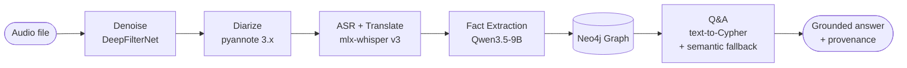
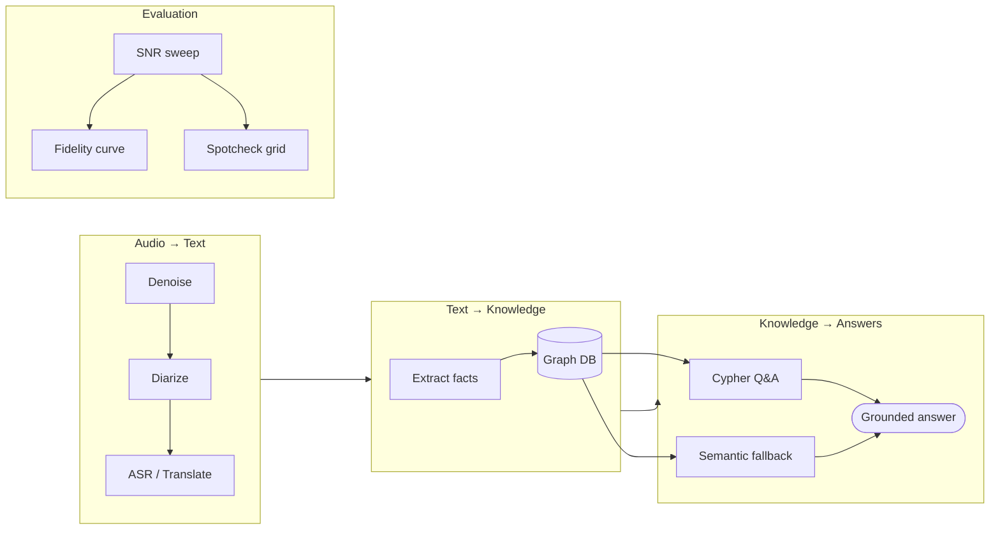

# Atyx Convo-KG — Product Overview

## Executive summary

Atyx Convo-KG is a local, batch-mode research prototype that turns recorded multi-party
conversations — spoken in Hinglish (Hindi-English code-mix), often over background noise —
into a structured knowledge graph and answers natural-language questions about what was said.
Every stage of the pipeline runs on-device using open-weight models; no data leaves the
machine and no frontier API is called.

The system chains five sequential stages: speech enhancement (DeepFilterNet), speaker
diarization (pyannote.audio), Hinglish-to-English ASR (mlx-whisper large-v3), LLM-driven
fact extraction with an induced-per-clip ontology (Qwen3.5-9B 4-bit via LM Studio), and
single-hop natural-language Q&A grounded against the populated Neo4j graph. Each answer
carries a verbatim source quote and the graph nodes it touched; the system will decline to
answer rather than hallucinate when no evidence is found.

This is an honest-scope prototype. It is single-user and local-only; there is no
authentication, no cloud deployment, no real-time streaming, and no multi-tenancy. The
design is measurement-driven: a controlled-SNR evaluation suite (café-babble sweep,
transcript-similarity curve, and spotcheck rows) makes accuracy vs noise directly
observable.

---

## The problem

Recorded meetings, advisory calls, and multi-party discussions in mixed Hindi-English
environments contain high-value information — commitments, decisions, named entities,
numbers — that is buried in noisy audio and never extracted. Existing tools either require
cloud APIs (privacy risk), do not handle code-mixed Hinglish, flatten facts into raw
transcripts (losing structure), or conflate multiple speakers.

Atyx Convo-KG addresses the full chain: denoise the audio, separate speakers, transcribe
and translate Hinglish to English, extract structured facts into a queryable knowledge graph,
and answer questions with grounded, citable answers — all on a local open-weight LLM running
on a single developer laptop.

---

## Key features

- **Speech enhancement** — DeepFilterNet suppresses background noise before ASR, making the
  transcript quality observable as a function of SNR.
- **Speaker diarization** — pyannote.audio 3.x segments and labels speakers (who said what);
  attribution is preserved all the way to the Q&A answer.
- **Hinglish-to-English ASR** — mlx-whisper large-v3 with the `translate` task transcribes
  code-mixed Hinglish and outputs English directly; Apple-Silicon optimized.
- **Induced-ontology fact extraction** — Qwen3.5-9B (4-bit, LM Studio) reads
  speaker-attributed chunks and emits schema-enforced JSON (entities, relations, facts);
  the ontology is induced per clip, not hand-coded.
- **Neo4j knowledge graph** — entities and relations stored as first-class nodes and typed
  edges; idempotent MERGE upserts; entity resolution merges near-duplicates by normalized
  name or embedding similarity (cosine ≥ 0.85, same label+type).
- **Grounded single-hop Q&A** — text-to-Cypher path with a semantic-embedding fallback;
  every answer carries `◆ source quote` provenance and highlighted graph nodes; the
  no-hallucination floor declines rather than fabricates when best-match cosine < 0.40.
- **Live audio upload** — drop any audio file (≤ 10 min) into the UI; the full pipeline
  runs live and produces a transcript + extracted-facts panel (no Neo4j write; graph/Q&A
  not available for uploaded clips — see Limitations).
- **Controlled-SNR evaluation** — the Experiment tab shows transcript-similarity vs SNR
  over a café-babble sweep and a spotcheck question grid; the accuracy-vs-noise degradation
  curve is directly inspectable.
- **Local open-weight LLM** — Qwen3.5-9B 4-bit via LM Studio OpenAI-compatible endpoint;
  no frontier API call; no data leaves the machine.

---

## Target users

This is a single-user local prototype. There is **no authentication, no login, no user
accounts, no admin panel, and no role system**.

| User type | Description |
|-----------|-------------|
| **Analyst / end-user** | Opens the browser UI at `http://localhost:8000`, selects a clip (or uploads one), runs the pipeline, reads the transcript, browses the knowledge graph, and asks questions via Ask-Atyx chat. |
| **Operator / developer** | Runs `./setup.sh` and `./start.sh` to install dependencies and start the server; edits `.env` for Neo4j password and HF token; loads models in LM Studio; may add clips to `config.yaml`. |

---

## Value proposition

| Property | What it means in practice |
|----------|--------------------------|
| **Privacy / on-device** | All audio, transcripts, and extracted facts stay on the local machine. No cloud API, no telemetry. |
| **Grounded, honest answers** | Every Q&A answer cites the verbatim statement it came from. The system returns `found: false` rather than hallucinate when evidence is absent. |
| **Multi-hop-ready graph** | Facts are stored as first-class entity nodes and typed relation edges, not text blobs. Single-hop queries work today; multi-hop traversals are a graph query away (constrained by local ~9B LLM Cypher quality, not architecture). |
| **Measurement-driven** | SNR degradation curves and spotcheck rows make the accuracy ceiling visible and reproducible, not claimed. |
| **Reproducible** | `./setup.sh` + `.env` edit + `./start.sh` is the full setup; no Docker for the app itself; three isolated venvs handle irreconcilable torch pins cleanly. |

---

## Technology stack

| Layer | Technology | Why chosen |
|-------|-----------|------------|
| Speech enhancement | DeepFilterNet (`.venv-denoise`, Python 3.11, torch 2.0.1) | Proven real-time-class speech denoising; isolated venv for torch pin compatibility |
| Diarization | pyannote.audio 3.x (`.venv-asr`) | State-of-the-art speaker segmentation; HF-gated model via `HF_TOKEN` |
| ASR + translation | mlx-whisper large-v3 (`translate` task, `.venv-asr`) | Apple-Silicon MLX backend; `translate` task gives Hinglish→English in one pass |
| LLM — extraction + Q&A | Qwen3.5-9B 4-bit via LM Studio (`http://localhost:1234/v1`) | Strong structured JSON output; Cypher/tool generation; multilingual; fits 24 GB sequentially alongside ASR |
| Embeddings — semantic fallback | `text-embedding-nomic-embed-text-v2-moe` via LM Studio | Local embedding model for statement-cosine semantic fallback in Q&A |
| Graph DB | Neo4j 5.x Community (local, single database) | Cypher for single/multi-hop traversal; idempotent MERGE upserts; open-source |
| API | FastAPI + uvicorn + SSE | Thin Python API; Server-Sent Events for real-time pipeline progress events |
| Frontend | dc-app (single-file `frontend/index.html` + vendored `support.js`) | No build step; served statically by FastAPI; custom lightweight React-like runtime |
| Orchestration | Python 3.12 main `.venv`; cross-venv via subprocess + disk artifacts | Three-venv isolation for irreconcilable torch pins; main venv is torch-free |
| Setup / env | uv (`setup.sh`, `start.sh`) | Fast, reproducible venv creation; `SKIP_AUDIO=1` for demo-only install |

---

## End-to-end pipeline

### Feature grouping by value

---

## Scope and honest limitations

| Area | Current state | Extension path |
|------|--------------|----------------|
| Q&A depth | **Single-hop** — one graph traversal per question | Graph and schema already support multi-hop; constrained by local ~9B Cypher generation quality |
| Uploaded clips | Pipeline runs live; transcript + facts panel shown. **No Neo4j write, no graph view, no Ask-Atyx chat** | Neo4j Community is a single-database server; per-clip graph isolation needs namespacing or a graph-per-database approach |
| Diarization on phone audio | Single-channel phone recordings (e.g. 911 clips) collapse to 1 speaker — the diarizer cannot separate what it cannot observe | Collapses gracefully with an honest UI note; does not affect far-field mic recordings |
| Extraction quality | Local ~9B LLM on noisy/code-mixed Hinglish is the measured accuracy ceiling — not a pipeline gap | Larger quantized models (14B+) or fine-tuning on Hinglish extraction improve this directly |
| Processing mode | **Batch only** — full pipeline runs end-to-end on a finished recording | Streaming ingestion would need chunked ASR + incremental graph upserts |
| Deployment | **Local only** — `localhost:8000`; no Docker Compose for the full stack, no cloud path | Auth, multi-tenancy, and cloud deployment are out of scope for v1 |
| Authentication | **None** — single-user local tool; no login, no roles, no admin panel | Not planned for this prototype |
| Target hardware | Apple M4, 24 GB unified memory; stages run **sequentially** to fit memory | Parallel execution feasible on higher-memory machines |

---

## Documentation map

| Document | Description |
|----------|-------------|
| [Product Overview](./product-overview.md) | This document — executive summary, features, stack, limitations |
| [System Architecture](./system-architecture.md) | Three-venv pipeline design, component interactions, data flow |
| [Entity Relationship](./entity-relationship.md) | Neo4j graph schema — node labels, relationship types, Pydantic contracts |
| [User Stories](./user-stories.md) | Analyst and Operator user stories; acceptance criteria |
| [Wireflows](./wireflows.md) | Screen-level user flows — clip selection, run, upload, Q&A, Experiment tab |
| [Wireframes](./wireframes.md) | UI layout annotations — Console and Experiment screens |
| [Sequence Diagrams](./sequence-diagrams.md) | Request/response sequences for every API call + SSE stream |
| [API Specification](./api-specification.md) | Full REST API reference — endpoints, request/response shapes, error model |
| [Deployment Guide](./deployment-guide.md) | Prerequisites, setup steps, `.env` config, start/stop, troubleshooting |
