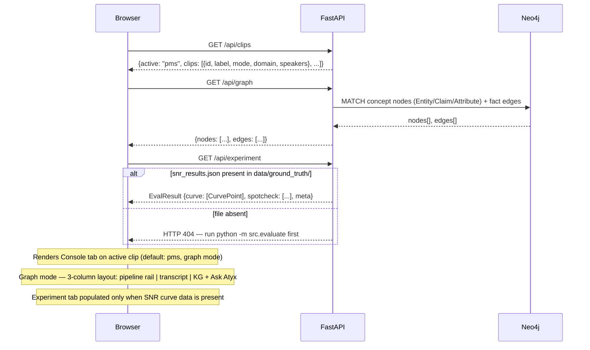
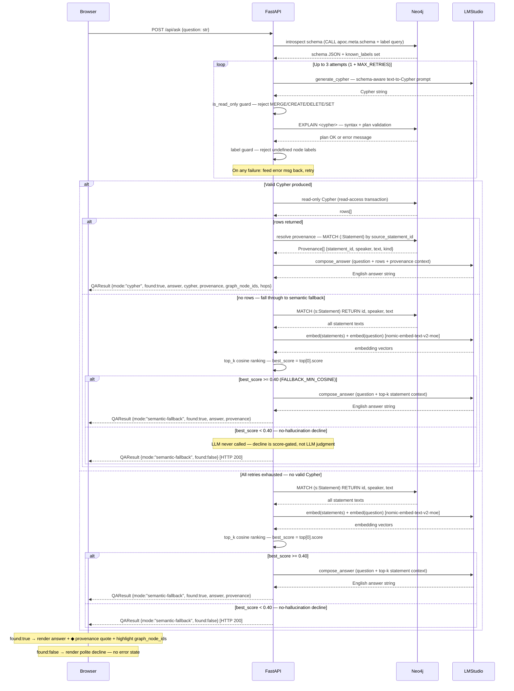
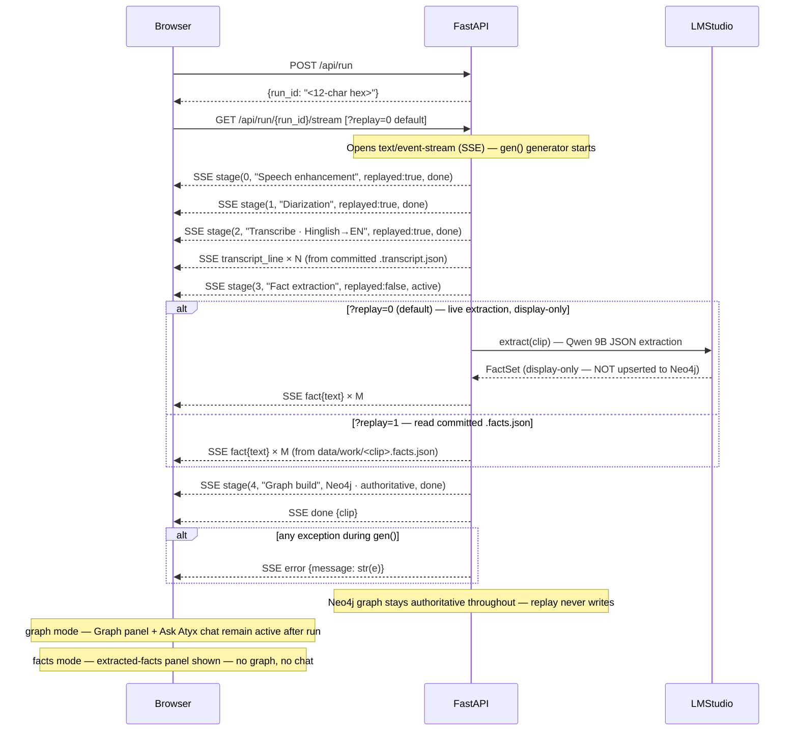
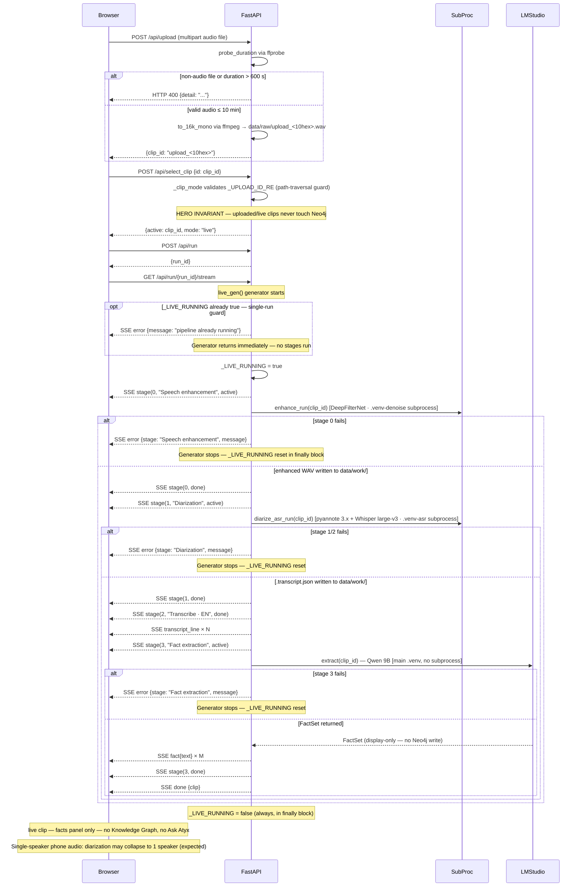
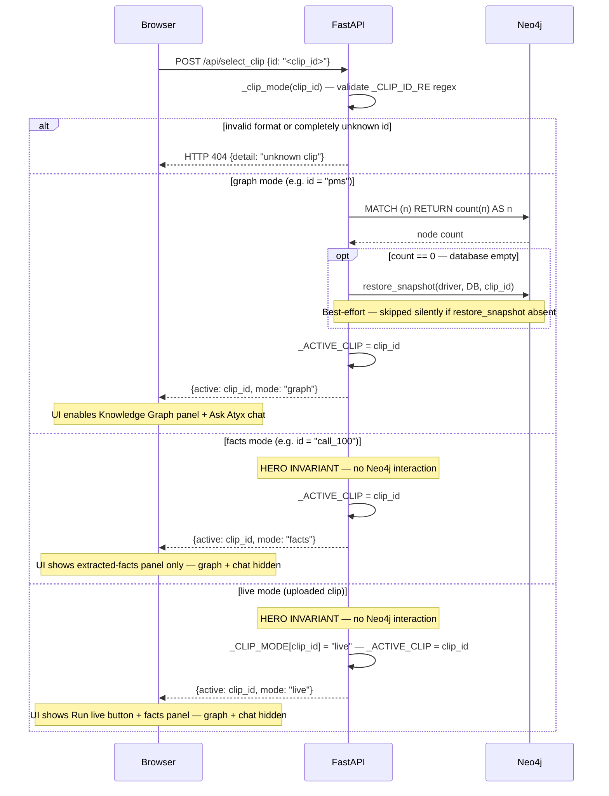

# Atyx Convo-KG — Sequence Diagrams

This document shows the key runtime interaction sequences for Atyx Convo-KG.
There is **no authentication or login flow** — the system is a local, single-user
research prototype with no user accounts, no sessions, and no auth middleware.
The real entry flow is the browser loading the static frontend and immediately
fetching graph/clips/experiment metadata from the FastAPI backend.

Related docs: [product overview](./product-overview.md) ·
[system architecture](./system-architecture.md) ·
[API specification](./api-specification.md) ·
[entity-relationship](./entity-relationship.md) ·
[wireflows](./wireflows.md) · [deployment guide](./deployment-guide.md)

---

## 1. App Load / Initialization

When the browser loads `http://localhost:8000` it receives the static
`frontend/index.html`. The dc-app runtime immediately fires three parallel
fetches to bootstrap state. There is no login step — the app is always
"authenticated" by virtue of running locally.

---

## 2. Ask a Question (Q&A)

Q&A is only available for `graph`-mode clips (the pre-built PMS hero). The
pipeline: introspect live Neo4j schema → text-to-Cypher via LM Studio (up to
3 attempts, `1 + MAX_RETRIES=2`) → run read-only Cypher → compose answer. If
Cypher fails or returns no rows, the system falls back to embedding-based
retrieval over `:Statement` nodes with a hard cosine floor of `0.40` — scores
below that floor return `found:false` without calling the LLM, ensuring no
hallucinated answers. A `found:false` result is still HTTP 200; the browser
renders the decline message without an error state.

---

## 3. Run Replay (graph / facts clip)

For pre-built clips (`pms` in graph mode, `call_100`/`call_103` in facts mode),
"Run" replays committed data. Stages 0–2 (Speech enhancement, Diarization,
Transcribe) are emitted immediately as `replayed:true` — no subprocess is
launched. The Fact extraction stage (index 3) is re-run live against LM Studio
by default (`?replay=0`) so the extraction proof is observable; the result is
display-only and **never upserted to Neo4j**. Passing `?replay=1` skips live
extraction and reads the committed `.facts.json` instead. The authoritative graph
in Neo4j remains untouched either way.

---

## 4. Live Upload

When a user uploads a new audio file, the full pipeline runs for real: denoise →
diarize → ASR → fact extraction, each stage as a subprocess in its own venv
(cross-venv via disk artifacts in `data/work/`). LM Studio handles fact
extraction in the main venv. The `_LIVE_RUNNING` boolean prevents concurrent
live runs. Uploaded clips are `live` mode — they show the facts panel only; no
Neo4j write, no graph, no Ask Atyx.

---

## 5. Select Clip / Graph Snapshot Restore

Clip selection updates the server-side active clip and, for `graph`-mode clips
only, triggers a best-effort Neo4j snapshot restore when the database is found
empty. `facts` and `live` clips never touch Neo4j — this is the **hero
invariant** that keeps the verified PMS graph intact regardless of other
activity. The clip picker in the UI is a click-to-toggle dropdown over the
registered clip registry (`config.yaml`).

