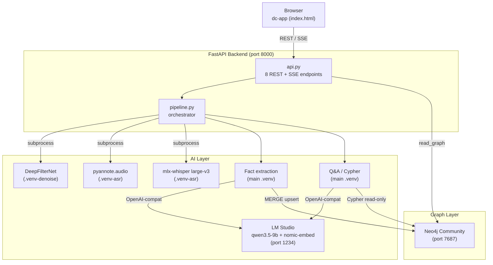
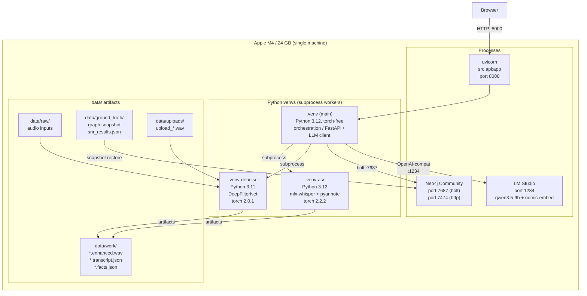

# Atyx Convo-KG — System Architecture

## High-level architecture

---

## Component architecture

### Frontend

The UI is a **single HTML file** — `frontend/index.html` — using `frontend/support.js`, a
vendored lightweight React-like dc-app runtime. There is no build step; FastAPI serves the
directory as static files. The frontend consumes SSE events from the backend to stream
pipeline progress in real time.

**Layout — two tabs:**

| Tab | Purpose |
|-----|---------|
| Console | Main pipeline UI: clip picker, Run button, pipeline rail, transcript, graph/facts, Ask Atyx chat |
| Experiment | Controlled-SNR fidelity curve + spotcheck rows |

**Clip modes** drive which columns render:

| Mode | Pipeline rail | Transcript | Knowledge Graph | Ask Atyx chat |
|------|--------------|------------|-----------------|---------------|
| `graph` | 5 stages | yes | yes (SVG, clickable) | yes (preset Q&A) |
| `facts` | 4 stages | yes | no | no |
| `live` | 4 stages | yes | no | no |

Graph mode is used by the `pms` clip (the verified hero). Facts and live modes apply to
the 911 dispatch clips and uploaded audio respectively. The graph and chat panels are
absent in facts/live mode because Neo4j Community is a single-database instance; isolating
a per-clip graph namespace was out of v1 scope.

The Knowledge Graph panel renders an SVG; clicking a node highlights its 1-hop
neighbourhood. Ask Atyx answers carry a `◆` source quote and highlight the answer's graph
nodes. Single-speaker phone clips show an honest "diarization could not separate speakers"
note.

---

### Backend / API

FastAPI application in `src/api.py`, served by uvicorn. The static frontend is mounted at
`/` last so all `/api/*` routes take priority.

**Eight endpoints:**

| # | Method + Path | Responsibility |
|---|--------------|----------------|
| 1 | `GET /api/graph` | Return concept graph (`{nodes, edges}`) from Neo4j — `:Entity/:Attribute/:Claim` nodes only |
| 2 | `POST /api/ask` | NL question → `QAResult`; `found=false` is still HTTP 200 (no-hallucination floor) |
| 3 | `GET /api/experiment` | Return `EvalResult` (SNR curve + spotcheck); 404 if `data/ground_truth/snr_results.json` absent |
| 4 | `GET /api/clips` | List the clip registry with `active` pointer |
| 5 | `POST /api/select_clip` | Switch active clip; 400 on invalid id, 404 on unknown; `graph` clips trigger Neo4j snapshot restore when DB is empty |
| 6 | `POST /api/run` | Dispatch a run on the active clip → `{run_id}` |
| 7 | `GET /api/run/{run_id}/stream` | SSE stream — `stage`, `transcript_line`, `fact`, `done`, `error` events. `?replay=1` replays cached `.facts.json`; default re-runs extraction live (display-only, never upserted). `live` clips invoke `pipeline.run_live`; `graph`/`facts` clips replay. |
| 8 | `POST /api/upload` | Multipart audio upload; validates duration ≤ 600 s, re-encodes to 16 kHz mono → `data/raw/upload_<10hex>.wav`; returns `{clip_id}`. No Neo4j write. |

**SSE run dispatch (live vs replay):**
- `live` clips → real `pipeline.run_live` is called; a boolean `_LIVE_RUNNING` guard prevents
  concurrent runs.
- `graph`/`facts` clips → `?replay=1` replays committed `.facts.json` artifacts; default
  path re-runs LLM extraction live against the cached transcript but does **not** upsert
  to Neo4j (display-only).

**Clip registry state** is managed in-memory (`_RUNS` dict mapping run_id → clip); the
active clip pointer is read from `config.yaml` at startup.

**Security / path-traversal guard:** clip IDs validated by `^[A-Za-z0-9_-]{1,64}$`; uploaded
clip IDs must match `^upload_[0-9a-f]{10}$`. Both checks happen at the single `_clip_mode()`
chokepoint before any filesystem access. Generated Cypher passes three defences: a write-clause
text guard, `EXPLAIN` validation with retry, and Neo4j read-access-mode transaction.

---

### AI layer

The pipeline runs **sequentially and batch** — not real-time streaming. On a 24 GB M4, only
one heavy model is resident at a time; each stage loads, runs, releases, and exits before the
next begins.

**Six stages (graph mode):**

| Stage | Model / Tool | Venv | Output artifact |
|-------|-------------|------|----------------|
| 1. Denoise | DeepFilterNet | `.venv-denoise` | `data/work/<clip>.enhanced.wav` |
| 2. Diarize | pyannote.audio 3.x | `.venv-asr` | diarization turns (in-memory to stage 3) |
| 3. ASR + translate | mlx-whisper large-v3, `task="translate"` | `.venv-asr` | `data/work/<clip>.transcript.json` |
| 4. Fact extraction | qwen3.5-9b via LM Studio | main `.venv` | `data/work/<clip>.facts.json` |
| 5. Graph build | Neo4j MERGE upserts | main `.venv` | Neo4j database (`:Speaker/:Statement/:Entity/:Claim/:Attribute` nodes) |
| 6. Q&A | qwen3.5-9b + nomic-embed via LM Studio | main `.venv` | Live HTTP response |

Facts/live mode skips stage 5 (Graph build); the pipeline rail shows 4 stages.

**Induced ontology:** Rather than a fixed schema, an ontology-proposal pass reads the transcript
and induces a small per-clip type/relation vocabulary. A fixed `BASE_ONTOLOGY` fallback is used
if the proposal is empty or degenerate. Entity labels are a closed allowlist
(`Speaker | Statement | Entity | Claim | Attribute`); relation types are charset-validated by
`safe_rel_type` — no raw LLM text is interpolated into Cypher.

**Local LLM via LM Studio:** `src/llm.py` is runner-agnostic; it talks to any OpenAI-compatible
endpoint (`base_url`/`model` from `config.yaml`). Qwen3.5-9b is a thinking model — **Reasoning/
Thinking must be OFF** in LM Studio so structured JSON lands in `content`. The client has a
`reasoning_content` fallback as a safety net.

**Three-venv isolation (and why):** DeepFilterNet pins `torch==2.0.1`; pyannote + mlx-whisper
pin `torch==2.2.2`; these versions are irreconcilable with each other and with the torch-free
main env. Isolation is achieved via subprocess workers (`scripts/denoise_worker.py`,
`scripts/asr_worker.py`) that communicate via typed disk artifacts (Pydantic v2 contracts in
`src/contracts.py`). The cost is subprocess hand-off latency; the benefit is a verified,
stable dependency set for each stage and auditability (each artifact can be inspected or
re-run in isolation).

**Entity resolution** (`resolve.py`): merge by exact normalized name first; embedding fallback
gated by cosine ≥ 0.85 AND same label+type — prevents distinct concepts (e.g. PMS vs AIF) from
collapsing.

**No-hallucination floor:** the semantic fallback declines (`found=false`) when the best
statement-cosine is below 0.40 (empirically tuned on the PMS corpus). This is a score-gated
refusal, not an LLM judgement call.

---

### Graph layer

**Neo4j Community 5.x**, single database, running locally (Docker or Neo4j Desktop). All writes
are idempotent `MERGE` upserts via the `neo4j>=5.20` Python driver.

**Node label backbone:**

| Label | Key properties | Role |
|-------|---------------|------|
| `:Speaker` | `id`, `name` | Diarized speaker |
| `:Statement` | `id`, `text`, `speaker`, `clip` | One per utterance — provenance backbone |
| `:Entity` | `id`, `type`, `name`, `...attrs` | First-class concept node |
| `:Claim` | `id`, `...` | Claim/decision concept node |
| `:Attribute` | `id`, `...` | Attribute/value concept node |

**Relationships:**

| Edge | Direction | Notes |
|------|-----------|-------|
| `:SAID` | `Speaker → Statement` | Attribution; established from diarization |
| `:<OPEN_RELATION>` | `Entity/Claim/Attribute → Entity/Claim/Attribute` | Fact edges; open vocabulary, charset-validated. Each carries `source_statement_id` |

**Provenance via `source_statement_id`:** every fact edge carries a `source_statement_id`
property joinable back to its `:Statement` node for a verbatim speaker quote. This is how
the Q&A answer grounding works — the graph is not just facts, it is source-traceable facts.

**`read_graph()` for the UI** returns only `:Entity/:Attribute/:Claim` nodes plus fact edges
between them. `:Speaker/:Statement` nodes are the provenance backbone and are not shown as
concept nodes in the UI.

**Read-only Cypher** is enforced via three layers: write-clause text guard on generated queries,
`EXPLAIN` validation with retry, and Neo4j read-access-mode transaction (a write that passes
the text guard is refused at the database).

**Single-database limitation:** Neo4j Community ships one database. Graph and Q&A are only
available for the `pms` (graph-mode) clip. Uploaded and facts-mode clips do not write to
or read from Neo4j; they stream extracted facts display-only. Per-clip graph namespacing
(via separate databases or a `clip` property scope) is the production path, documented in
[./deployment-guide.md](./deployment-guide.md).

---

## Deployment architecture

This is a **local, single-user, single-machine** deployment. No containers, no cloud
infrastructure, and no authentication are shipped. Everything runs on the developer's
machine.

---

## Data flow

One clip through the full pipeline:

```mermaid
flowchart LR
    Raw["data/raw/\npms.wav\n(raw audio)"]
    Enhanced["data/work/\npms.enhanced.wav\n(denoised)"]
    Trans["data/work/\npms.transcript.json\n(English utterances\n+ speaker labels)"]
    Facts["data/work/\npms.facts.json\n(entities + fact edges\n+ statement grounding)"]
    DB["Neo4j\n:Speaker :Statement\n:Entity :Claim :Attribute\nfact edges + source_statement_id"]
    QA["Q&A\ntext-to-Cypher\nor semantic fallback\n→ English answer\n+ provenance quote"]

    Raw -->|"DeepFilterNet\n(.venv-denoise)"| Enhanced
    Enhanced -->|"pyannote + mlx-whisper\n(.venv-asr)"| Trans
    Trans -->|"qwen3.5-9b\nLM Studio\n(induced ontology\nchunk→extract→resolve)"| Facts
    Facts -->|"Neo4j MERGE\nidempotent upsert\n(main .venv)"| DB
    DB -->|"Cypher read-only\n+ embedding fallback"| QA
```

For **facts/live mode** clips (uploaded audio, 911 clips), the pipeline stops after the
`Facts` step — the graph build and Q&A stages are skipped. Extracted facts are streamed
display-only and never written to Neo4j.

---

## Technology choices

| Choice | Rationale | Tradeoff |
|--------|-----------|----------|
| **Neo4j Community, single database** | Cypher is the natural language for graph traversal; well-documented, local Docker install, driver `neo4j>=5.20` is stable and idiomatic | Community edition is one database — no per-clip namespace; uploaded/facts clips cannot use graph Q&A without a paid licence or separate instance |
| **Local LLM via LM Studio (qwen3.5-9b, 4-bit)** | No frontier API cost or data-exfiltration risk; qwen3.5 is strong at structured JSON and Cypher generation; 4-bit fits within 24 GB alongside ASR | Hard ceiling: extraction quality on noisy code-mixed Hinglish is non-deterministic run-to-run; complex multi-hop Cypher is unreliable at ~9B scale |
| **Three isolated Python venvs** | DeepFilterNet (torch 2.0.1) and pyannote/mlx-whisper (torch 2.2.2) have irreconcilable pins; isolation is the only stable solution | Subprocess hand-offs over disk artifacts add latency and complexity; disk IO is the communication channel |
| **mlx-whisper translate path (no WhisperX forced-alignment)** | WhisperX forced-alignment requires the transcript to be in the same language as the audio; translate yields English text against Hindi audio — the aligner drops 67% of segments and passes 41% Devanagari. mlx-whisper translate produces 100% English, 100% coverage | Segment-level speaker attribution only (no per-word audio offsets); sufficient for single-hop Q&A provenance |
| **dc-app no-build frontend** | Zero build toolchain dependency; a single HTML file is served statically by FastAPI; works out of the box on any machine | Custom runtime (not React/Vue); team familiarity required; SVG rendering uses `foreignObject` for text (dc-app constraint) |
| **Batch pipeline (not streaming)** | Sequential stage execution keeps peak memory within 24 GB M4 budget; each stage loads → runs → fully releases before the next | No real-time ingestion; a 10-minute clip takes minutes end-to-end; not suitable for live meeting transcription without architectural changes |
| **Pydantic v2 disk artifacts as cross-stage contracts** | Typed, validated, auditable; each stage's output is inspectable and re-runnable in isolation; makes debugging straightforward | Adds disk I/O between every stage; not suitable for low-latency pipelines |
| **Semantic fallback with cosine floor 0.40** | Score-gated refusal (not LLM judgement) — verifiable, tunable, no hallucination below the floor; empirically verified on the PMS corpus | Floor was tuned on one domain; a different domain may need re-calibration |
| **Induced per-clip ontology** | Adapts to any conversation domain without a hard-coded schema; `BASE_ONTOLOGY` fallback prevents degenerate output | Ontology quality is bounded by the local model; inconsistent label assignment (e.g. same concept as `:Entity` in one run, `:Attribute` in another) motivates the label-agnostic Cypher matching strategy |

---

**See also:** [./deployment-guide.md](./deployment-guide.md) · [./api-specification.md](./api-specification.md) · [./sequence-diagrams.md](./sequence-diagrams.md) · [./entity-relationship.md](./entity-relationship.md) · [./product-overview.md](./product-overview.md)
