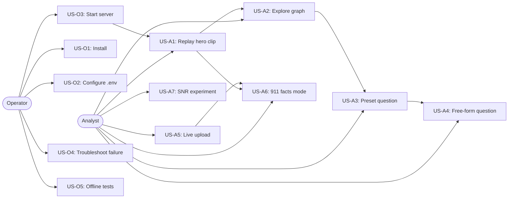

# Atyx Convo-KG — User Stories

> **Who it's for vs. how the prototype runs.** Atyx Convo-KG is built for a **private-wealth firm**
> — a PMS / AIF / RIA whose advisors are in client conversations all day. The **domain personas**
> below (Relationship Manager, Compliance Officer) describe **who the product serves and why**. The
> **prototype interaction personas** further down (Analyst, Operator) describe **how the single-user
> local demo is actually driven** — there is no login, no accounts, and no multi-tenancy in v1.

See also: [./wireflows.md](./wireflows.md) · [./wireframes.md](./wireframes.md) ·
[./product-overview.md](./product-overview.md) · [./deployment-guide.md](./deployment-guide.md)

---

## The product, in one line

Turn every advisor–client conversation into a structured, queryable record of the **advice given** —
products, strategies, fees, and suitability — automatically, and **without a word leaving the firm**.

### Why local, why now

These calls carry client PII, live portfolio positions, and sometimes material non-public
information. They **cannot** be shipped to a cloud frontier API. Running extraction and Q&A on a
**local open-weight LLM** is not a constraint we merely tolerated — it is the reason the product can
exist inside a regulated wealth firm at all. **Data residency is the moat.**

---

## Domain persona: Relationship Manager / Wealth Advisor

An RM has dozens of client conversations a week — advisory calls, product walk-throughs, suitability
discussions. The advice given in those calls (what was recommended, why, and for whom) is the firm's
most valuable and most perishable asset. Today it lives in the RM's memory or hand-typed CRM notes.

### US-RM1 — Recall what was recommended without re-listening

> As an RM, I want to ask _"what strategy did we recommend on this call?"_ and get a grounded answer
> with the exact quote, so that I can prep the follow-up in seconds instead of re-listening to a
> ten-minute recording.

- **Value:** advice recall; zero manual note-taking.
- **Demonstrated in the prototype by:** US-A3 (preset _"What strategy does a PMS follow?"_),
  US-A4 (free-form question), US-A2 (graph trace of the `FOLLOWS_STRATEGY` edges).

### US-RM2 — Reconstruct the comparison basis presented to the client

> As an RM, I want to see how the recommended product was framed against alternatives (e.g. PMS vs.
> mutual fund), so that I keep my positioning consistent across every client touchpoint.

- **Value:** consistent positioning; faster, accurate onboarding of new clients.
- **Demonstrated by:** US-A3 / US-A4 over the `COMPARES_TO` and `SEGREGATES_FROM` edges.

### US-RM3 — Confirm who a product was positioned as suitable for

> As an RM, I want to ask _"who is this product suitable for?"_ and see the suitability segment that
> was actually discussed, so that I document suitability the way the conversation framed it.

- **Value:** suitability captured at the source, not reconstructed from memory.
- **Demonstrated by:** US-A3 / US-A4 over `TARGETS_DEMOGRAPHIC` (Affluent HNI segment).

---

## Domain persona: Compliance Officer

The Compliance Officer must be able to show — in line with SEBI suitability expectations — that the
advice given was appropriate, was actually said, and never left the firm's control. They care about
audit trails, groundedness, and data residency.

### US-C1 — Trust that every answer is grounded, never fabricated

> As a Compliance Officer, I want every answer to carry the source quote it came from, and I want the
> system to **decline** when a question isn't supported by the conversation, so that the record is
> defensible and never invented.

- **Value:** audit-ready, defensible answers; no hallucinated advice on the record.
- **Demonstrated by:** US-A3 (◆ source quote), US-A3-S2 and US-A4-S3 (honest decline at the cosine
  floor — _"No answer found in the graph."_).

### US-C2 — Keep all processing on-premise

> As a Compliance Officer, I want extraction and Q&A to run entirely on local infrastructure, so that
> client PII, portfolio data, and MNPI never leave the firm's control.

- **Value:** data residency; regulatory defensibility.
- **Demonstrated by:** the whole stack — local LM Studio + local Neo4j (US-O3); the pipeline makes
  **no external API calls**.

---

# Prototype interaction personas

> The two personas below are _functional_ roles describing how the **single-user local demo** is
> driven — not access levels. There is no login screen, no admin panel, and no multi-tenancy. In a
> real deployment, the RM and Compliance Officer above are served through these same surfaces.

## Persona: Analyst / end-user

The Analyst opens the app in a browser, explores the demo clips, asks questions, uploads audio,
and views the experiment results. No setup knowledge required — the Operator has already run
`start.sh`.

---

### US-A1 — Replay the verified hero clip

> As an Analyst, I want to click "Run replay" on the default PMS clip and watch the pipeline
> animate end-to-end, so that I can see the full audio-to-knowledge-graph pipeline in one step.

**Scenario 1 — Happy path**

- **Given** the app is open at `http://localhost:8000` and the `pms` clip is active (default)
- **When** I click "Run replay"
- **Then** the button label changes to "Running…"; the pipeline rail animates through 5 stages
  (Speech enhancement → Diarization → Transcribe · Hinglish→EN → Fact extraction → Graph build);
  speaker-attributed English transcript lines stream into the Transcript panel; and the Knowledge
  Graph SVG renders entity nodes and labelled fact edges.

**Scenario 2 — Double-click protection**

- **Given** a run is already in progress (button shows "Running…")
- **When** I attempt to click Run again
- **Then** the button is disabled; no second run is triggered; the existing stream continues.

**Scenario 3 — Post-run state**

- **Given** a run has completed
- **When** the `done` SSE event is received
- **Then** the button resets to "↻ Replay run"; the Knowledge Graph is reloaded from `/api/graph`;
  all 5 stage dots show as filled.

---

### US-A2 — Explore the knowledge graph

> As an Analyst, I want to click a node in the Knowledge Graph to see its one-hop neighbourhood
> highlighted, so that I can trace how entities and claims relate to each other.

**Scenario 1 — Node click**

- **Given** the Knowledge Graph is rendered (pms clip, run complete)
- **When** I click a node (e.g. "PMS")
- **Then** that node and its directly connected edges and neighbour nodes highlight (gold accent);
  unconnected nodes dim.

**Scenario 2 — Clear selection**

- **Given** a node is selected and highlighted
- **When** I click the same node again or click the SVG background
- **Then** the selection clears and all nodes return to default opacity.

**Scenario 3 — Facts / live clips have no graph**

- **Given** a `call_100` or uploaded clip is active (facts / live mode)
- **When** I complete a run
- **Then** no Knowledge Graph panel appears; the center column shows Transcript + Extracted Facts
  instead; the right Ask-Atyx column is absent entirely (Neo4j Community single-DB limitation,
  documented by design).

---

### US-A3 — Ask a preset question

> As an Analyst, I want to click a preset question ("What strategy does a PMS follow?") and
> receive a grounded English answer with a source quote, so that I can verify the Q&A is backed
> by transcript evidence rather than hallucination.

**Scenario 1 — Grounded answer**

- **Given** the pms Knowledge Graph is loaded
- **When** I click a preset (e.g. "What strategy does a PMS follow?")
- **Then** a POST to `/api/ask` is issued; the answer bubble appears in the chat panel; a ◆ source
  quote from the matching Statement node is shown; graph nodes referenced in the answer highlight.

**Scenario 2 — Off-topic or out-of-graph question**

- **Given** the pms Knowledge Graph is loaded
- **When** I ask a question about something not in the graph (e.g. "What is the weather today?")
- **Then** the answer reads "No answer found in the graph." (HTTP 200, `found: false`); no
  hallucinated content is returned; semantic fallback declined because best cosine < 0.40 floor.

**Scenario 3 — Chat disabled before run**

- **Given** the pms clip is active but no run has been performed in this session
- **When** I view the Ask Atyx panel
- **Then** a prompt reads "Run the pipeline to ground the chat in the graph."; the input is present
  but the graph may already be loaded from the persisted snapshot (loaded on mount via `/api/graph`).

---

### US-A4 — Type a free-form question

> As an Analyst, I want to type my own question in the Ask Atyx input and receive a Cypher-grounded
> answer or a clear honest decline, so that I know the system does not invent answers.

**Scenario 1 — Cypher-mode answer**

- **Given** the pms graph is loaded
- **When** I type "Who is a PMS suitable for?" and press ↑
- **Then** the LLM generates a read-only Cypher query; it runs against Neo4j; the composed English
  answer is returned with `mode: "cypher"` and a ◆ source quote.

**Scenario 2 — Semantic-fallback answer**

- **Given** the pms graph is loaded and the question maps to no clean Cypher pattern
- **When** I submit a question
- **Then** the system falls back to embedding similarity over Statement nodes; if best cosine ≥ 0.40
  the closest statement is used; answer returned with `mode: "semantic-fallback"`.

**Scenario 3 — Decline at floor**

- **Given** best statement cosine < 0.40 for my question
- **When** I submit
- **Then** `found: false`; the answer reads "No answer found in the graph."; no fabricated content.

---

### US-A5 — Upload an audio clip and watch live processing

> As an Analyst, I want to upload my own audio file and see it processed through the pipeline in
> real time, so that I can validate the system on a conversation I recorded.

**Scenario 1 — Valid upload (≤ 10 minutes)**

- **Given** the Console screen shows the empty/upload state
- **When** I click the upload area, select a valid audio file (≤ 600 s), and confirm
- **Then** the file is POST-ed to `/api/upload`; the clip is registered as live mode; a run starts
  automatically ("Run live"); the 4-stage pipeline rail animates (no Graph build stage); transcript
  lines and extracted facts stream in real time; when done, Transcript and Extracted Facts panels
  are populated; no Knowledge Graph or Ask-Atyx appear.

**Scenario 2 — File exceeds 10-minute cap**

- **Given** I select an audio file longer than 600 seconds
- **When** the upload is attempted
- **Then** `/api/upload` returns HTTP 400; an error message appears in the extracted-facts panel
  ("error: …"); no pipeline run starts; the UI remains on the upload state.

**Scenario 3 — Non-audio file**

- **Given** I select a `.pdf` or `.png` file
- **When** the upload is attempted
- **Then** `/api/upload` returns HTTP 400; error surfaced in the facts panel; no processing starts.

**Scenario 4 — Pipeline stage fails mid-run**

- **Given** a live upload run is in progress
- **When** a stage errors (e.g. LM Studio unreachable during fact extraction)
- **Then** an SSE `error` event is emitted with a message; the error is shown in the facts panel;
  the run is marked complete; the button resets; no silent hang or fake success.

---

### US-A6 — Read extracted facts for a 911 call clip

> As an Analyst, I want to select a 911 dispatch clip and see extracted English facts, so that I
> can explore the pipeline on a different domain even without graph or Q&A support.

**Scenario 1 — Select and run call_100**

- **Given** the Console screen
- **When** I open the clip dropdown, select `call_100` (911 water rescue), and click "Run replay"
- **Then** the UI switches to 2-column facts mode; a 4-stage pipeline runs; Transcript and Extracted
  Facts panels appear; no Knowledge Graph, no Ask-Atyx chat.

**Scenario 2 — Single-speaker diarization note**

- **Given** the `call_100` or `call_103` clip run has completed
- **When** the transcript resolves to only one distinct speaker (expected for single-channel phone audio)
- **Then** an honest note is shown: "diarization could not separate speakers for this clip"; no
  crash; facts are still extracted.

**Scenario 3 — Switching back to pms**

- **Given** `call_100` is active in facts mode
- **When** I open the dropdown and select `pms`
- **Then** the UI returns to 3-column graph mode; the Knowledge Graph and Ask-Atyx panels reappear;
  the PMS graph snapshot reloads from `/api/graph`.

---

### US-A7 — View the SNR degradation experiment

> As an Analyst, I want to click the Experiment tab and read the fidelity curve and spotcheck
> results, so that I understand at what noise levels the pipeline starts to degrade.

**Scenario 1 — Experiment data available**

- **Given** `data/ground_truth/snr_results.json` exists
- **When** I click the "Experiment" tab
- **Then** the SNR Degradation Study screen appears; the transcript-similarity-vs-SNR curve renders
  (SVG line chart, x-axis SNR dB, y-axis cosine similarity); spotcheck rows show the same preset
  question answered on the clean clip vs a degraded clip at a specified SNR.

**Scenario 2 — Experiment data absent**

- **Given** `data/ground_truth/snr_results.json` is missing (e.g. audio pipeline was skipped)
- **When** I click the "Experiment" tab
- **Then** GET `/api/experiment` returns 404; the screen renders without a curve or spotcheck rows;
  the app does not crash; a clear empty state is shown.

---

## Persona: Operator / developer

The Operator clones the repo, runs setup and start scripts, configures the environment, and is
responsible for keeping the demo healthy. This persona understands the terminal.

---

### US-O1 — Install the system from scratch

> As an Operator, I want to run `./setup.sh` once and have all three virtual environments and a
> `.env` template created, so that I can reproduce the environment from any clean checkout.

**Scenario 1 — Full install (audio pipeline included)**

- **Given** `uv`, Python 3.12, and Python 3.11 are available on PATH
- **When** I run `./setup.sh`
- **Then** `.venv` (Python 3.12, main), `.venv-asr` (Python 3.12, mlx-whisper + pyannote),
  and `.venv-denoise` (Python 3.11, DeepFilterNet) are created; a `.env` template is written;
  no errors.

**Scenario 2 — Demo-only install (no audio pipeline)**

- **Given** I set `SKIP_AUDIO=1` before running
- **When** I run `SKIP_AUDIO=1 ./setup.sh`
- **Then** only `.venv` is created; `.venv-asr` and `.venv-denoise` are skipped; the demo
  (graph Q&A, replay) works; live upload / audio processing stages are unavailable.

---

### US-O2 — Configure the environment

> As an Operator, I want to populate `.env` with `NEO4J_PASSWORD` and `HF_TOKEN`, so that the
> system can connect to the local Neo4j instance and download pyannote models.

**Scenario 1 — Correct configuration**

- **Given** `.env` was created by setup.sh
- **When** I set `NEO4J_PASSWORD=<my-neo4j-password>` and `HF_TOKEN=<my-huggingface-token>`
- **Then** `start.sh` preflight successfully connects to Neo4j; pyannote model download succeeds
  on first audio run.

**Scenario 2 — Missing HF_TOKEN on demo-only install**

- **Given** `SKIP_AUDIO=1` was used and `HF_TOKEN` is not set
- **When** I run `start.sh`
- **Then** preflight skips the pyannote check; demo replay and graph Q&A work; live upload
  triggers an error if attempted (pyannote not installed).

---

### US-O3 — Start the server and restore the demo graph

> As an Operator, I want to run `./start.sh` and have Neo4j + LM Studio preflighted, the verified
> PMS snapshot restored, and the API serving at `http://localhost:8000`, so that the demo is
> ready in a single command.

**Scenario 1 — All prerequisites met**

- **Given** Neo4j Desktop is running locally; LM Studio is serving `qwen3.5-9b` and
  `text-embedding-nomic-embed-text-v2-moe` with Reasoning/Thinking OFF; `.env` is configured
- **When** I run `./start.sh`
- **Then** preflight passes all checks; the verified PMS Neo4j graph snapshot is restored
  (idempotent MERGE); FastAPI + uvicorn start at `http://localhost:8000`; the frontend loads.

**Scenario 2 — LM Studio not running**

- **Given** LM Studio is not started
- **When** I run `./start.sh`
- **Then** preflight fails with a clear error ("LM Studio not reachable at localhost:1234");
  `start.sh` exits non-zero; the server is not started; no silent hang.

**Scenario 3 — Neo4j not running**

- **Given** Neo4j Desktop is stopped
- **When** I run `./start.sh`
- **Then** preflight fails with a clear Neo4j connection error; exit non-zero.

---

### US-O4 — Troubleshoot a failed pipeline stage

> As an Operator, I want a pipeline stage failure to surface as an explicit SSE error event, so
> that I can diagnose the root cause without staring at a frozen UI.

**Scenario 1 — Mid-run stage failure**

- **Given** a run is in progress (graph or live mode)
- **When** a stage fails (e.g. LM Studio becomes unreachable, Neo4j write fails)
- **Then** the SSE stream emits an `error` event with a human-readable message; the UI displays
  the error; the run transitions to done state; the Run button resets; no fake success event.

**Scenario 2 — Watchdog timeout**

- **Given** a graph-mode replay run has been running for > 90 seconds with no `done` event
- **When** the watchdog fires
- **Then** the UI finishes the run state; the button resets; no permanent hang.

---

### US-O5 — Run tests without external services

> As an Operator, I want `pytest` (default, no `-m integration` flag) to complete successfully
> without LM Studio, Neo4j, or network access, so that I can verify pure-logic correctness in CI.

**Scenario 1 — Unit tests pass offline**

- **Given** `.venv` is activated, LM Studio and Neo4j are not running
- **When** I run `pytest`
- **Then** all non-integration tests pass; tests marked `integration` are skipped; no network calls
  are made.

---

## Persona → Story map

