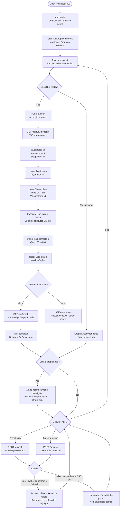
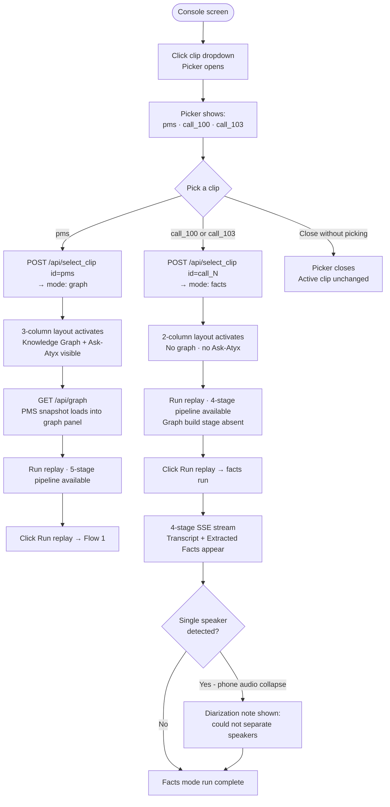
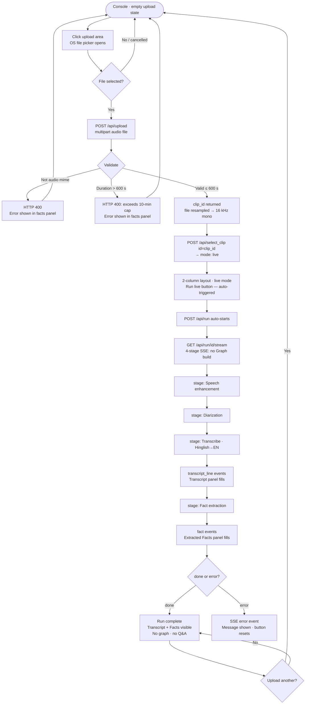
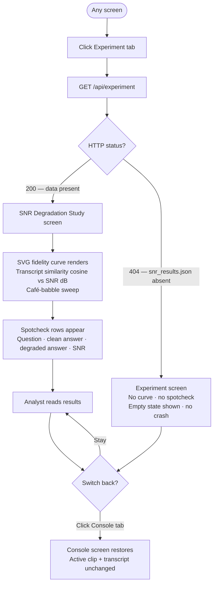

# Atyx Convo-KG — Wireflows

Navigation flows for the single-screen local app. Each flow is a Mermaid flowchart. Decision
diamonds mark branching paths; honest negative/edge cases are included throughout.

See also: [./wireframes.md](./wireframes.md) · [./user-stories.md](./user-stories.md) ·
[./sequence-diagrams.md](./sequence-diagrams.md) · [./api-specification.md](./api-specification.md)

---

## Flow 1 — App entry and verified-hero run

The default view when the app loads. The `pms` clip (Private-wealth advisory, graph mode) is
active by default. The Knowledge Graph pre-loads from `/api/graph` on mount, so the graph is
visible even before a Run. Clicking "Run replay" re-executes the 5-stage pipeline over the
committed JSON artifacts and re-populates the transcript and graph.

---

## Flow 2 — Clip switching

The clip dropdown in the left rail is a click-to-toggle picker showing the three registry clips.
Selecting a clip calls `/api/select_clip`, which returns the clip's mode. The mode drives the
UI layout: `graph` → 3-column with graph and Ask-Atyx; `facts` → 2-column with facts panel
only. The Neo4j graph is only touched for `graph`-mode clips (HERO INVARIANT: `call_100` and
`call_103` never write to Neo4j).

---

## Flow 3 — Live upload

Any audio file the user uploads is assigned a transient `upload_XXXXXXXXXX` clip ID, switched
into `live` mode, and run immediately. Live mode uses the real pipeline (not replay), produces
facts output only, and never writes to Neo4j. There is no graph or Ask-Atyx for uploaded clips.

---

## Flow 4 — Experiment tab

The Experiment tab is independent of the clip selection and Q&A flow. It shows the pre-computed
SNR degradation curve (transcript cosine similarity vs. café-babble SNR) and spotcheck rows
comparing clean-clip answers to degraded-clip answers. The data is served from a committed JSON
artifact; if the file is absent (e.g. audio pipeline was skipped), the API returns 404 and the
tab renders an empty state without crashing.

